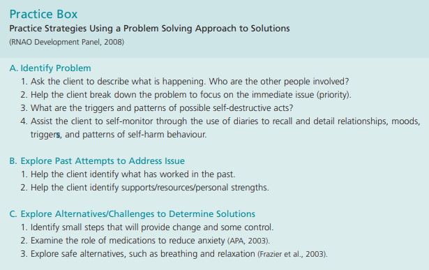
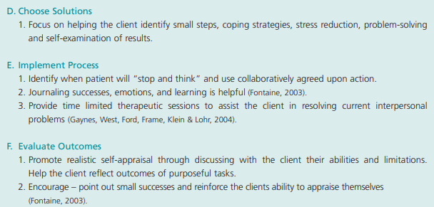

# Population 
* Males are 4x more likely to die by suicide and females make more attempts. 
* LGBTQ increased risk related to stigma, discrimination, violence, harassment and family rejection 
  * Older persons are also at in increased risk related to higher prevalence of depression, loneliness and isolation, role changes in retirement, death loved ones, lack of support services 
(William Osler Health System (WOHS), 2020)

## Risk factors 
* Psychiatric diagnosis: depression, anxiety, addictions and substance use or loneliness 
  * 90% of individuals that end their lives thought suicide present with a psychiatric disorder, with eating disorders having the highest prevalence 
	* those who present with depression, despair and ruminate hopelessness 
	* individuals that present with guilt, fear, failure or poor self- esteem 
	* high incident in those with new diagnosis of schizophrenia or first psychosis 
* those with borderline personality disorder may present with self- mutilation tendencies 
* increased risk with previous attempt 
* Stresses 
	* Recent Major loss (death, unemployed, divorce)
* Role change (Teens and Seniors) 
* recent trauma 
* unstable family environment or inadequate social supports  
* in the elderly population, it is not uncommon for somatic symptoms of pain to increase the week preceding attempt (RNAO, 2009)
* increased risk associated with history of family member/ friend attempt
* individuals who participate in self- injurious behaviors related to psychological distraction  
* Feelings of being humiliated or manipulated 
* Is associated with impulsively and substance use
* History of physical, sexual or emotional abuse
* Difficulties with academic performance: actual and perceived 
* After individuals are discharged from hospital, 40% of those that die by suicide pass away before their first follow up. 
	* return to stressors outside the hospital without adequate support and insight
* unable to detect relapse due to inadequate supervision in the community  
(WOHS, 2020)

Warning signs similar to symptoms of depression: 

* Sleeplessness/ sleepiness,
* Social withdrawal, 
* loss of appetite,
* Anhedonia, 
* and often a preoccupation with death or dying

Individuals may present as: 

* Impulsive or irritable 
* risk taking (Sexual promiscuity, increased alcohol use, no longer attending school/ work, driving under the influence)
* May start to take action to prepare for death (give away possessions, make a will or withdraw insurance money)
(WOHS, 2020)

[The-Mental-Health-Continuum.pdf (openingminds.ca)](https://learn.openingminds.ca/wp-content/uploads/2020/05/The-Mental-Health-Continuum.pdf)  (MHCC,2020)

Mental health is a continuum with healthy individuals can find themselves experiencing distress, due to stressors) and those with psychiatric diagnosis, with appropriate coping mechanisms, can find themselves living healthy lives. 
This is important to note when fostering hope for individuals with suicidal ideation. 

In the model linked above, the distinction between reacting and injured phase is the persistence of symptoms, with invasive symptoms no longer functioning as an appropriate response to circumstance.
Symptoms of injury include:

* Impairment in functioning (changes to ADLs / poor hygiene, poor quality work submitted, low energy, etc.)
* breakdown of relationships
* Symptoms more generalized, no longer present with specific stressors 
* Transition into illness involves meeting criteria for psychiatric disorder (persistent impairment in functional ability, inability to maintain clear/ consistent thoughts and planning

## Protective factors
Protective factors are aspects of the person's life that gives them reward, meaning or a sense of purpose (RNAO, 2020). 
 
### Internal factors 
* Feeling of social belonging 
* Perception of connection and satisfaction with school and employment 
* Peelings of self- worth and motivation 
* Help- seeking behaviour 
* Recognition of healthy life skills (Good decision making, coping strategies, impulse control and perseverance) (WOHS, 2020)
* Natural supports 
  * support in the community (Family, friends, faith group, etc) as identified by the client. Ask if the client is in a safe relationship, if they find their relationships supportive. Do not make assumptions (MHCC, 2020) 

### External factors
* Family cohesion and healthy relationships (Shared interest, bonding, emotional support)
* Responsibility for family and pets
* Access to resources in the community for mental health and substance use that the client perceives to be adequate 
* Religious and community connections, cultures of support against suicide
(WOHS, 2020)

# RNAO Practice Recommendations 

## Assessment
"The nurse will take seriously all statements made by the client that indicate, directly or indirectly, a wish to die by suicide, and/or all available information that indicates a risk for suicide" (RNAO, 2009)

When performing a risk assessment, involve the client, their relationships and medical history. 

Interview for suicidal ideation, plan and protective factors [Interview Questions for Assessment of Suicidal Ideation and Plan | Nursing Best Practice Guidelines (rnao.ca)](https://bpgmobile.rnao.ca/content/interview-questions-assessment-suicidal-ideation-and-plan)

Signs include: 

Direct statements: "I am going to kill myself"
Indirect Statements : I can't take it anymore"
Indirect expression (Behavioural) (Often sudden): End-of-life planning (arranging a will, giving belongings away, donating body to science, neglect for self- care and relationships) and obtaining lethal means (Storing medications, obtaining firearms)

If suspected: ask! 
There is no evidence that asking a person directly about self- harm and suicide with increase their risk (RNAO, 2009)

"Are you thinking about ending your life?" 
 "Are you suicidal?" 
 "Do you have a plan to take your own life?" 
 "Do thoughts of death or suicide enter your mind?"

### Risk assessment 

Incorporate professional judgment: incorporate assessment data with findings from family and friends to ensure accurate assessment, monitor for recent changes in behaviour and ensure the safety of the patient (WOHS, 2020)

Ideation: 

* assess for active plan/ intent 
* Passive suicidal ideation: The patient wishes to no longer live, may wish something to occur, but has no plan or intent to harm themselves. 
* Active suicidal ideation: patient has a plan or intention to kill themselves, these individuals are at a much greater risk 
* Assess access to lethal means 
* Frequency and duration of thoughts
* Protective factors: What brings their life meaning? What do they enjoy doing? Who are their social supports? 

Behaviour: 

*History of attempt: Aborted attempt (Stopped themself) or interrupted attempt (By another individual)
* Controllability: Has the patient aborted an attempt in the past? Do they have adequate/ fair/ poor impulse control? 
*Act: Have they participated in a dangerous/ risk taking behaviours that may have led to their death? (DUI, Overdose)
* Taken action to acquire lethal means

High risk: 

Need of admission with persistent ideation and planning 

* Experience of command hallucinations 
* Psychiatric symptoms/ depression or increased irritation
* Recent discharge 
* If in the community, reach out to crisis mobile team or police: In peel the Mobile crisis rapid response team is dispatched through emergency services (911)
* Amission: assess medical stability, constant observation, belonging search, minimum restraint policy 

Low risk: 

* Passive ideation: thought of death with no plan, intent or behaviour 
* Modifiable risk factors: Specific symptoms, psychosocial stressors and inadequate support
* Strong protective factors
* require outpatient referral, symptom reduction and access to support in the community (Crisis line, Community mental health programs) 
(WOHS, 2020)

### Documentation/ Communication 

Every suicide assessment should be documented in a timely manner and include follow-up with appropriate resources and during TOA (RNAO,2020; WOHS, 2020)

#### TOA
Important components at my placement: 

Patient
Room 
Form 

Ask: Do you know this patient? 

Yes: 

* provide update: current presentation, client concerns, changes in behaviour, risk assessment, current suicidal/ homicidal ideation 

No: 

* Diagnosis and previous admissions 
* Events leading to admission  
* Mental status summary: 
* Mood/ affect 
* Behaviour during interactions + compliance + need for encouragement? 
* thoughts and perception 
* Suicidal/ homicidal ideation 
* Comment on any safety/ management concerns (Irritation/ anxiety) and strategies for de-escalation/ redirection (Coloring, topics for redirection, PRN)
* Communicate any of the patients concerns
* Health teaching provided/ limits in place 
* Ongoing/ pending assessment or procedures: ECT, ortho consult, Epival bloodwork, etc. 

Meet criteria for eight components of transitional care (Naylor et al, 2017)

SBARR

[The SBAR approach to communication](https://youtu.be/LNnr5tFkN6g?t=235)

[Patient Handover (SBARR)](https://youtu.be/TJQxG8kTS8Q?t=199)

Concise handoff or information to other professionals in the healthcare team: 

Situation: immediate/ relevant patient information, Patient (Subjective + Objective data)

Background: Patient History

Assessment: Nursing assessment

Recommendation: What outcome/ action does the does the speaker believe needs to happen 

Response feedback: Do you have any questions? Verify understanding

Example: 

Hi Dr._, regarding _ your patient in __R, 50 years old with a history of schizophrenia. He decompensated in the community and was admitted from home by his 2 adult daughters. He is experiencing paranoid delusions regarding the police and is irritable. For safety, should the order for chemical restraints be renewed?

Thank you, is there any other information you need from me?

## Therapeutic communication 
"The nurse works toward establishing a therapeutic relationship with clients at risk for suicidal ideation and behaviour" (RNAO, 2009)

Therapeutic communication is essential for patient centered care and itself is protective against suicide when fostering feelings of hope, being heard, respected and connected (RNAO,2009).

Therapeutic communication involves active listening skills, and positive body language that conveys genuineness and empathy in order to develop trust and engage a client to accurately assess and meet the client’s needs (RNAO, 2020). 

In mental health and addictions, agitation and perceived breach of trust from safety interventions, such as increased observation or contacting emergency services, are barriers to a therapeutic relationship (RNAO, 2020). 

Empathy vs. sympathy 

[Brené Brown on Empathy](https://www.youtube.com/watch?v=1Evwgu369Jw&t=1s)

#### Communication skills 

Utilize open -ended questioning: 

* How was your day today?
* What are you thinking/ feeling? 
* Can you describe how you're feeling right now?
(Swan, 2017)

Active listening skills 

Remain empathetic and objective 

Encouraging 

* Convey interest: involves verbal and non verbal communication that invites expression 
* Examples "
* Uh-huh."  "Oh?"  "When?" "Really?" "I see" "yes" (Swan, 2017)
* Make use of eye contact, nodding and mirroring 
	* eye contact and nodding conveys understanding 
	* mirroring involves matching the speakers facial expression and conveys empathy 
(Swan, 2017)

Use silence! 

* Pausing and waiting for a response when speaking 
* Helpful in mental health when clients may have delayed response times or need to process their emotions 
* Conveys that the listener is thoughtful and attentive 

Clarifying 

* Reflecting on the speakers words, works best in combination with "I" statements
* "I am hearing that_, is that accurate"
* "I am not sure I understand, can you_?"

Emotional labeling 

* The patient’s experience may be overwhelming and without identifying their emotions they cannot begin to regulate their response (Swan, 2017)
* Labening feeling using expressed words or direct observation: "I see_, I get the feeling that you’re _, is that right/ accurate?"
Validate emotions and provide reassurance, do not minimize emotions. (Swan, 2017)

Use "I" messages

* Lets the interviewer convey what they see/ feel in a non- defensive manner. Prevents the speaker from feeling attacked or accused. (Swan, 2017)
* I notice that you seem down lately, Would you like to talk about it?
* I feel uncomfortable when being spoken to that way. Please, don’t yell at me
* I would like to get a better understanding of _, can you tell me more about it
Focus on conveying empathy during interactions 
* "I see", "I would like to confirm if i understand_." 
* Do not comment possibly or negatively, avoid assigning value to responses 
* Reassure the patient that it is safe to be honest about how they feel. 

#### Interpersonal Communication 

One-to-one communication between the nurse and the client. Due to environmental and social context the message can sometimes be received differently than the speaker meant to convey. In these relationships it is vital that the meeting of communications need to be validated (Potter et al, 2017). 

Interpersonal variables: Factors that influence communication between the sender and receiver 
It is the nurses responsibility to seek out factors that aid in the effectiveness and sensitivity of communication (Potter et al, 2017). 

Environmental factors such as comfort, safety, privacy and distractions (noise) interfere with messages sent (Potter et al, 2017). 

Patient related factors such as pain, anxiety and medication side effects may also communicate. In the mental health setting the patient's condition related to insights, delusions and hallucinations can be a barrier to effective communication.  

###### Verbal communication

spoken or written word, is unsuccessful if the sender and receiver cannot decode the words they use to communicate and cannot accurately convey a message to one another. The use of interpreters when there is a language barrier and avoiding the use of medical jargon is important when communicating with patients. 

* Connotative meaning: one word can have several meanings. Nurses need to be purposeful with  their language and avoid terms that may be misinterpreted (Potter et al, 2017).  

* Communicate at an appropriate speed/ pace-> speak slowly and enunciate clearly. 
* Awkward pauses can be unsettling for patients and speaking deliberately slowly or rapidly can convey an unintended message 
* Intonation and tone dramatically affect the meaning of a message. It's also important in mental health to pay attention to the patient's emotional state. 
* Clarify: it's important to practice simple and brief communication to avoid confusion. 
	* add on phrases such as "You know?" and "Right?" can be distracting 
* Timing: Be appropriate with your communication. Ensure patients are alert, oriented and comfortable when providing health teaching. 

###### Nonverbal Communication

Nonverbal communication is often culturally dependent and can determine if something like eye contact is therapeutic or not. 

*Professional Appearance: includes physical characteristics, facial expression, manner of dress and grooming. 
*Facial Expression: related to affect. Important to be aware of your depression, furrowing your brow or frowning can be taken as a sign of judgment. 

Therapeutic Communication Techniques: 

Involve purposeful and specific responses to encourage the expression of feelings and ideas.  

* Active Listening. Active listening means being attentive to what the patient is saying both verbally and nonverbally. It enhances trust and facilitates patient communication because it demonstrates acceptance and respect for the patient. Several nonverbal skills facilitate active listening

SOLER 

* S: Sit facing the patient. This posture indicates that you are there to listen and are interested in what the patient is saying. 
* O: Keep an open posture (i.e., keep arms and legs uncrossed). This posture suggests that you are receptive ("open") to what the patient has to say. 
* A "closed" position may convey a defensive attitude, possibly invoking a similar response in the patient. 
* L: Lean toward the patient.This posture indicates that you are involved and interested in the interaction. 
* E: Establish and maintain intermittent eye contact. This behaviour conveys your involvement in and willingness to listen to what the patient is saying. Absence of eye contact or shifting of the eyes indicates that you are not interested in what the patient is saying. 
* R: Relax. It is important to communicate a sense of being relaxed and comfortable with the patient. Restlessness communicates a lack of interest and also conveys a sense of discomfort that may extend to the patient. Sharing Observations. Nurses make observations by commenting on how the patient looks, sounds, or acts. Stating observations often helps the patient communicate without the need for extension

* ask open ended question and state observations and ask for clarificaiton 

* Empathy is the ability to convey understanding of another person's reality based on the accurate perception of spoken word. Empathy is expressed when you explore the patient's perception without judgment and is conveyed when you provide neutral statements to provide validation to the patient’s experience. (Potter et al, 2017)

* Sharing hope: Can instill hope and self- confidence by keeping communications positive, encourage goal- setting and aid in problem solving with the patient. Comment on positive aspects of the person's behavior, performance and response. (Potter et al, 2017)
"The nurse fosters hope with the suicidal client." (RNAO, 2009)
* Hopelessness and feelings of inadequacy influence a person's perception of their ability to improve their circumstances. A strong therapeutic relationship can improve self- worth and hope. (RNAO, 2009)
* Providing reassurance 
 	* Validating a person's experience "it’s ok to feel like this given the situation, there is treatment and support, there is help available" (MHCC, 2020)
	* You can foster hope in the client by validating their feelings and helping them realize their circumstances are subject to change.

* Providing Information: empower patients to make informed decisions and encourage their involvement in their care. Informed decisions are associated with less anxiety and improve a patient's sense of control. 

* Paraphrase and Clarify: rephrase a patient's response and confirm if this is the message they meant to convey, provides the opportunity to address miscommunication or convey understanding.

* Summarize: provide a concise review of the interaction and the results of the conversation (future action). 

Non therapeutic techniques 

* Sympathy: sympathy is the subjective vision of another person's viewpoint. Occurs when you make assumptions about the clients experience. 
* Asking for explanations: Asking why questions and explaining why they believe a certain way. May influence a client to act defensively. 
* approval/ disapproval: do not impose your personal beliefs or attitudes on a patient. Do not tell them what they "should" and "should not" do or what is "Not right". Value judgements may hinder the therapeutic relationship. It's important to avoid automatic and defensive responses. 
* False reassurance/ changing the topic: Offering automatic responses not based on facts or strengths the client has identified can make a patient feel isolated and contribute to distress. Abruptly changing to topic will make a client feel unheard.  More therapeutic to take the time and ask "What would be helpful at this time?" and other open ended questions. 
* Asking personal questions when they are not relevant is not appropriate in professional communication 
(Potter et al, 2017)

#### Survivors 
Family/ friends of individuals that have died by suicide struggle with their emotional reactiosn and are at an increased risk of suicidal ideation themselves due to shock of the sudden death of a loved one. (MHCC, 2020)

They may feel:

* They may feel anger, betrayal, disconnected from or abandoned by their loved one.
* Experience guilt or feel an exaggerated responsibility for their loss
* that the suicide was malicous or a way to communicate with them 
* may behave as death has not occured 
(WOHS, 2020)
Cultural or religious practices against suicide may act as a barrier for communicaiton and may lead to isolation for the survivors that cannot alcholage the situuaiton and reach out for support. (MHCC, 2020)
Concerns regarding stigma may lead to survivors withdrawing from social support for the fear of being judged by society. 

To aid families, implement the therapeutic communication strategies listed above: 
Listen non- judgmentally to their concerns and avoid cliche responses. 
Talk about the person who passed in a positive light. 
Offer information and resources available in the community and document difficult times (Holidays, anniversaries, birthdays) and arrange for support at these times. 

## Stigmatizing language 
"Minimize the feelings of shame, guilt and stigma that may be associated with suicidality, mental illness and addiction" (RNAO, 2009)

Communication, even with the best intentions, can be hindered if someone feels judged. 
Important to foster respectful environments where individuals feel safe to discuss their experience. 

* Use Person first language to avoid defining an individual by their illness. 
	* Someone living with schizophrenia, not a schizophrenic 
	

	 
* Be purposeful with your language 
* Don’t assume someone with a diagnosis is "Suffering" from that diagnosis unless the client identifies as such. Element of sympathy, and is not therapeutic. (MHCC,2020)
* Ask if someone has used substances, or when the last time that was. Don't ask how long they’ve been clean. Associated with a value judgment which implies they were dirty or somehow lesser when using substances. 
Therapeutic interactions express respect, tolerance and affirm the client’s self-worth (RNAO, 2009). These techniques help mitigate stigma and shame to combat isolation and help patients feel supported (MHCC,2020). 

## Reflection 
"Beware of your own negative attitudes, beliefs and behaviours, which may have negative impact on the client." (RNAO, 2009)

* Reflection on your own values and judgment will help you make ethical decisions and act in accordance to the client’s goals. 

# Cultural Competence 
"The nurse provides care in keeping with the principles of cultural safety/cultural competence." (RNAO, 2009)
Culture may inflience how mental health, suicide and death are discussed. In cultures where suicide is a taboo, even though these are protective factors, can indice shame and isolation in survivors or even prevent those experiencing ideaiton from reaching for support. 
In order to communicate effectively with the patient regarding their values, it's important  that you use the communication skills listed above to help the individual feel safe and free of judgment. (MHCC, 2020) 

## Safety
"The nurse assesses and manages factors that may impact the physical safety of both the client and the interdisciplinary team." (RNAO,2009)

* Nurses need to ensure  their own safety first. If needed dissingadge until adequate supports (Other team members, police or emergency services, code white) are available 
* restrains
	* physical  restraints aggravate mental conditions and fester feelings of loss of control in the client. (RNAO, 2009)

Restraint policy 

[Promoting Safety: Alternative Approaches to the Use of Restraints | Nursing Best Practice Guidelines (rnao.ca)](https://bpgmobile.rnao.ca/category/guidelines/promoting-safety-alternative-approaches-use-restraints)

[Potential hazardous items](https://bpgmobile.rnao.ca/content/potential-hazardous-item)

"The nurse ensures that observation and therapeutic engagement reflects the client’s changing suicide risk."
Agency Care round policy: 

[Observation Policy Mental Health and Addictions](https://drive.google.com/file/d/1D6fiSEpzZHmSDraq2mzctQaL72U1tF3h/view?usp=sharing)

* When performing observation it's important to engage the client during assessment. Interaction during observation helped patients feel safer and cared for. Alternatively, distant or silent  observations make patients feel frustrated and intruded upon. (RNAO,2009)

Crisis intervention 

[Observation Policy Mental Health and Addictions](https://drive.google.com/file/d/1D6fiSEpzZHmSDraq2mzctQaL72U1tF3h/view?usp=sharing)

[Crisis Intervention for Adults Using a Trauma-Informed Approach: Initial Four Weeks of Management](https://rnao.ca/bpg/guidelines/crisis-intervention)

[Crisis Intervention | Nursing Best Practice Guidelines (rnao.ca)](https://bpgmobile.rnao.ca/guideline-content/12)

De-escalation 

[De-escalation Tips | Nursing Best Practice Guidelines (rnao.ca)](https://bpgmobile.rnao.ca/node/849)

[Preventing Violence, Harassment and Bullying Against Health Workers](https://rnao.ca/bpg/guidelines/preventing-violence-harassment-and-bullying-against-health-workers)

[Personal De-escalation Plan](https://bpgmobile.rnao.ca/sites/default/files/Appendix%20R%20Personal%20De-escalation%20Plan.pdf)

[Safewards Model (rnao.ca)](https://bpgmobile.rnao.ca/sites/default/files/Appendix%20J%20Safewards%20Model.pdf)

[STAMPEDAR Framework](https://bpgmobile.rnao.ca/sites/default/files/Appendix G STAMPEDAR Framework.pdf)

Speaking to individuals experiencing delusions 

[How can I communicate with someone experiencing psychosis? - Practical strategies and tips for effective support (nsw.gov.au)](https://www.health.nsw.gov.au/mentalhealth/psychosocial/strategies/Pages/communicating-psychosis.aspx)

[Steps for Working With Delusions - BC Schizophrenia Society (bcss.org)](https://www.bcss.org/support/how-do-i-get-help-for-my-loved-one/steps-working-delusions/)

Alternative risk assessment 

[Suicide Assessment and Management Competencies for Nurse](https://www.apna.org/m/pages.cfm?pageid=5684)

# Interventions and Strategies 

## Self- worth strategies 
Possible Strategies for Affirming Client’s Self-Worth | Nursing Best Practice Guidelines (rnao.ca)
"The nurse works collaboratively with the client to understand his/her perspective and meet his/her needs." (RNAO, 2009)
Utilize effective communication techniques, so the client can convey their perspective and feel understood and supported. 

## No-suicide contracts 
"The literature suggests that no-suicide contracts are frequently employed as assessment and/or management tools by health care professionals despite the lack of empirical evidence to support their use" (RNAO, 2009)
These contracts should consist of an agreement within a probable time frame with a contingency plan. These should only be applied in context of the therapeutic relationship. 

Contracting for safety: 

[Contracting for Safety: A Misused Tool](http://patientsafety.pa.gov/ADVISORIES/Pages/201306_82.aspx#:~:text=%E2%80%9CContracts%20for%20safety%2C%E2%80%9D%20%E2%80%9C,written%20but%20are%20sometimes%20verbal.&text=These%20terms%20are%20often%20used%20interchangeably%20by%20providers.)

## Limit setting 

[South Australia public health limit setting guidelines (sahealth.sa.gov.au)](https://www.sahealth.sa.gov.au/wps/wcm/connect/c7bb94004903b7e6979af70e3d7ae4ad/MH+R%26S+Fact+Sheet+3+Effective+Limit+Setting.pdf?MOD=AJPERES&amp;CACHEID=ROOTWORKSPACE-c7bb94004903b7e6979af70e3d7ae4ad-niRco1R)

## Strength-based Problem solving 
Strength based questioning and problem solving 

[Coping with problems by focusing on solutions](https://drive.google.com/file/d/1EEiBGDxUgMdUAlhmjpMKXHIqbAD4XpbX/view?usp=sharing)

"The nurse uses a mutual problem-solving (client nurse) approach to facilitate the client’s understanding of how they perceive his/her own problems and generate solutions." (RNAO, 2009)

* Therapeutic to help the client identify stressors in their life and aid them in the development of alternative coping strategies. Clients may not understand the connection between their suicidal ideation and stressors (RNAO, 2009). 
* Encouraging client involvement in generating their own goals and strategies increases their sense of mastery of the situation. Mastery is the person's feeling of control after the forces that act on them 
* Barriers to problem solving may be symptoms of confusion or experiencing difficulty thinking clearly due to increased stress response or other mental health symptoms (RNAO, 2009).

## Health teaching 

Deep breathing: 

[Deep Breathing (Worksheet) | Therapist Aid](https://www.therapistaid.com/therapy-worksheet/deep-breathing-worksheet/anxiety/none)

Sleep hygiene: 

[Sleep](https://www.stjoes.ca/patients-visitors/patient-education/patient-education:-p-t/sleep-pdf) 

Medication: 

[Patient Education - St. Joseph's Healthcare Hamilton (stjoes.ca)](https://www.stjoes.ca/patients-visitors/patient-education)

[Medication Information - Valproate Sodium (stjoes.ca)](https://www.stjoes.ca/patients-visitors/patient-education/patient-education:-u-z/valproate-sodium---medication-information-pdf)

Goal setting: 

[Goals Worksheets | Therapist Aid](https://www.therapistaid.com/therapy-worksheets/goals/none)

ECT: 

indicated for acutely suicidal patients in specific circumstances (Depression) (RNAO, 2020). 

[A review of electroconvulsive therapy in suicidality | Mental Health Clinician | Allen Press](https://meridian.allenpress.com/mhc/article/5/5/212/127701/A-review-of-electroconvulsive-therapy-in)

[Electroconvulsive therapy (ECT) for depression in elderly people | Cochrane](https://www.cochrane.org/CD003593/DEPRESSN_electroconvulsive-therapy-ect-for-depression-in-elderly-people)

[Electroconvulsive therapy for treatment-resistant schizophrenia | Cochrane](https://www.cochrane.org/CD011847/SCHIZ_electroconvulsive-therapy-treatment-resistant-schizophrenia)

Mindfulness interventions: 

[EIDM worksheet](https://www.cadth.ca/sites/default/files/pdf/htis/june-2015/RC0669%20Mindfulness%20for%20PTSD%2C%20GAD%2C%20Depression%2C%20and%20Substance%20Abuse%20Final.pdf )

[What are the benefits of mindfulness? (apa.org)](https://www.apa.org/monitor/2012/07-08/ce-corner)

[Mindfulness - CMHA National](https://cmha.ca/documents/mindfulness)

[The mindfulness trajectories of addressing suicidal behaviour: A systematic review - Saurabh Raj, Debasruti Ghosh, Sunil K Verma, Tushar Singh, 2020 (sagepub.com)](https://journals.sagepub.com/doi/abs/10.1177/0020764020960776)

[Coping Skills: Anxiety](https://www.therapistaid.com/therapy-worksheet/coping-skills-anxiety )

[Mindfulness exercises - Mayo Clinic](https://www.mayoclinic.org/healthy-lifestyle/consumer-health/in-depth/mindfulness-exercises/art-20046356)

Benefits of Cognitive behavioural therapy: important for addressing the psychosocial symptoms of borderline personality and schizophrenia. 

[Cognitive-behavioural therapy (CBT) | CAMH](https://www.camh.ca/en/health-info/mental-illness-and-addiction-index/cognitive-behavioural-therapy)

[Dialectical Behaviour Therapy (DBT) | CAMH](https://www.camh.ca/en/health-info/mental-illness-and-addiction-index/dialectical-behaviour-therapy)

[Treatments for the Prevention and Management of Suicide: A Systematic Review: Annals of Internal Medicine: Vol 171, No 5 (acpjournals.org)](https://www.acpjournals.org/doi/full/10.7326/m19-0869)

Complementary and alternative modalities: manage their suicidal behaviour related to depression, anxiety or a mental illness: herbal remedies, dietary supplements, massages/reflexology, aromatherapy, acupuncture, yoga, meditation and music (RNAO, 2002)

# References 

Mental Health Commission of Canada (MHCC). (2020). Crisis response- Caring for others
Registered Nurses’ Association of Ontario. (2009). Assessment and Care of Adults at Risk for Suicidal Ideation and Behaviour. Toronto, Canada: Registered Nurses’ Association of Ontario.

Naylor, M. D., Shaid, E. C., Carpenter, D., Gass, B., Levine, C., Li, J., Malley, A., McCauley, K., Nguyen, H. Q., Watson, H., Brock, J., Mittman, B., Jack, B., Mitchell, S., Callicoatte, B., Schall, J., & Williams, M. V. (2017). Components of Comprehensive and Effective Transitional Care. Journal of the American Geriatrics Society, 65(6), 1119–1125. https://doi.org/10.1111/jgs.14782

Swan, J. (2017). Mental Health Crises Intervention and Support for Patients. Sacramento, US: Wild Iris Medical Education. 

William Osler Health System. (2020). Module 1: Suicide Risk Understanding and Assessing 

